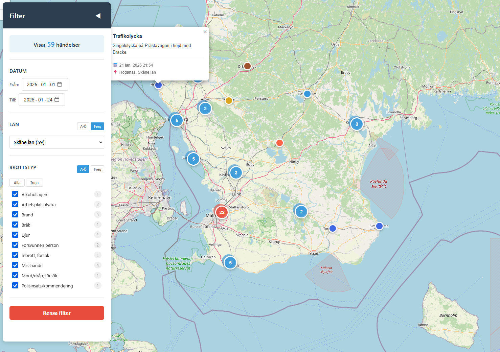

# Brottskartan Sverige - Crime Map Application

🇬🇧 **[English documentation available here →](README_EN.md)**

En webbapplikation som visualiserar brottsdata från Polisens officiella API på en interaktiv karta med klustrad presentation per kommun.

## 🎯 Funktioner

### 📊 Datahämtning och bearbetning
- **Automatisk hämtning** från `https://polisen.se/api/events`
- **Intelligent periodisk uppdatering** var 10:e minut med rate limiting
- **Deduplicering** av händelser baserat på ID
- **Lokal lagring** i localStorage för offline-tillgång och snabb laddning
- **Automatisk datafiltrering** - exkluderar:
  - Sammanfattningar och pressmeddelanden
  - Trafikkontroller
  - Administrativa meddelanden (öppettider, telefonistörningar, etc.)

### 🗺️ Kartvisualisering
- **Interaktiv karta** med Leaflet + OpenStreetMap
- **Klustrad visning** - Händelser grupperas per kommun med nummerade markörer
  - 🔵 Blå: < 10 händelser
  - 🔴 Röd: 10-99 händelser
  - 🟣 Lila: 100+ händelser
- **Färgkodade individuella markörer** baserat på brottstyp
- **Detaljerade popups** med:
  - Brottstyp och beskrivning
  - Datum och tid (HH:MM format)
  - Kommun och län
- **Automatisk zoom** till valt län
- **Spiderfy-effekt** vid max zoom för tydlig visning av täta områden

### 🔍 Avancerat filtreringssystem

#### Datumfilter
- Filtrera händelser mellan specifika datum
- Snabbåtkomst med förfyllt "Till"-datum (idag)

#### Länsfilter
- Välj specifikt län från dropdown
- **Sortering**: Alfabetisk (A-Ö) eller efter frekvens (mest förekommande först)
- Visar antal händelser per län
- Automatisk zoom till valt län

#### Brottstypfilter
- Välj specifika brottstyper med checkboxar
- **Sortering**: Alfabetisk eller efter frekvens
- Visar antal händelser per brottstyp
- **Snabbval**: "Alla" eller "Inga" knappar
- Räknare uppdateras dynamiskt baserat på valt län
- Döljer brottstyper med 0 händelser i valt län

#### Filterinteraktion
- Realtidsuppdatering av kartan
- Visar antal synliga händelser
- "Rensa filter"-knapp för snabb återställning
- Automatiskt val av alla tillgängliga brottstyper vid länsval

### 📍 Geografisk databearbetning

#### Kommunbaserad positionering
- Alla händelser placeras vid kommuncentrum (inte exakta GPS-koordinater)
- **Fördelar**:
  - Integritetsskydd - ingen exakt platsangivelse
  - Tydlig aggregering av händelser per kommun
  - Konsekvent presentation
  
#### Intelligent geo-enriching
- **Region → Kommun-mappning**: Använder län för att hitta kommun
- **Kommun → Region-mappning**: Omvänd uppslagning vid behov
- **Fallback-logik**: Använder länshuvudstad om kommun saknas
- **Case-insensitive matchning**: Hanterar "Upplands väsby" och "Upplands Väsby"
- **Komplett svensk geodata**: 290 kommuner i 21 län

## 🔒 Säkerhet och integritet

### Dataskydd
- ✅ All data lagras **lokalt** i webbläsaren (localStorage)
- ✅ Inga exakta GPS-koordinater - endast kommuncentrum
- ✅ Ingen data skickas till externa servrar (utom Polisens API)
- ✅ Ingen användarspårning eller analytics
- ✅ Data raderas genom att rensa webbläsarens cache

### CORS och API-säkerhet
- Polisens API tillåter CORS från alla ursprung
- Ingen API-nyckel krävs
- Rate limiting på klientsidan (10 min intervall)

---

**Skapad**: 2026-01-24  
**Version**: 2.0.0  
**Senast uppdaterad**: 2026-01-24  
**Data-källa**: [Polisen.se API](https://polisen.se/api/events)  
**Geo-data**: Statistics Sweden (SCB), OpenStreetMap
